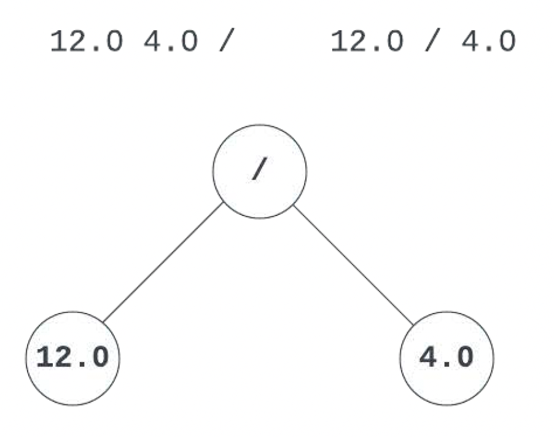
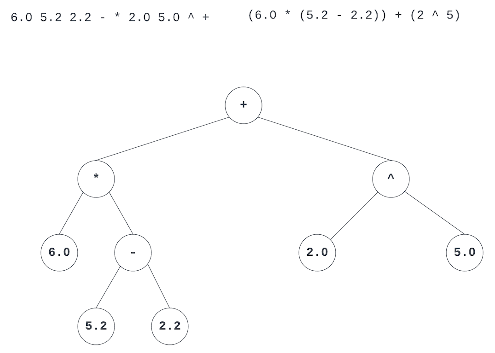
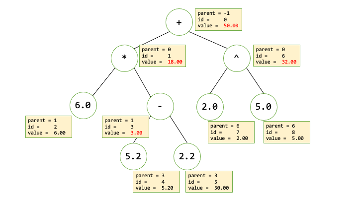

# Creates an Expression Tree from a Postfix Expression

## Goal
The goal of this program is to create an expression tree given a postfix arithmetic expression. I practiced the following concepts in this lab:
* Expression Tree, with dynamic allocation of nodes
* Tree Traversals, traverse the expression tree using the three traversal types: Inorder, Postorder, Preorder
* Expression Tree Evaluation, evaluate the arithmetic expression represented by the tree

## Expression Trees
One way to represent arithmetic operations is by using an expression tree. This kind of tree can be a binary tree, or a multiway tree depending on how many operands can the operators have. For this assignment you will work with binary trees.

The picture below shows the expression tree for the infix expression $\frac{12.0}{4.0}$. Above the tree you can see the postfix and infix expressions.



Notice in the image that the operator $/$ is the root of the tree and that its operands are the children of that node. Also, you can see that if you traverse that tree inorder, the output will be the infix notation of that expression, if you traverse postorder you will get the postfix notation, and if you traverse preorder you will get the prefix notation.

| Infix      | Postfix        | Prefix          |
|------------|----------------|-----------------|
| $12.0/4.0$ | $12.0\ 4.0\ /$ | $/ \ 12.0\ 4.0$ |

Below is an additional expression tree for the expression: $6.0 * (5.2 - 2.2) + 2 ^ 5$.




## My Task for this Program

In this program I designed the classes and their code to:
* Read/Receive a postfix expression and from it create the Expression Tree. This is done by instantiating the class `Tree` and calling its method `BuildTree`. This operation creates in memory the tree. The root of the tree is pointed by data member `_root`. This data member is type `TreeNode*` which is left to you to implement.
* Once the tree is built in memory then I traversed the three using all three traversal types (Inorder, Preorder, and Postorder). These traversals return a string showing the data on each of the tree nodes. For this you will call the `Tree::Traverse` method.
* The next phase is to evaluate the expression stored in the tree. This is done calling the `Tree::Evaluate`. This method returns a double that is the result of evaluating the expression.
* Lastly, I implemented the method `Tree::StepByStepCalculation` this method sends to the `ostream` parameter the data stored on each of the nodes as they were calculated. The information that this operation displays will show the "structure" of the tree.

### Step by Step 

Given the following expression: `6 5.2 2.2 - * 2 5 ^ +` each of the steps explained above would look as follows.

#### Build Tree
The expression tree would graphically look like:


Another view of the tree, in text mode would be:
```
Operator +
    Operator *
        Operand 6.00
        Operator -
            Operand 5.20
            Operand 2.20
    Operator ^
        Operand 2.00
        Operand 5.00
```

#### Traversing the Tree
When traversing the tree generated in the previous step the result would be:
* **Inorder**: `6 * 5.2 - 2.2 + 2 ^ 5`
* **Preorder**: `+ * 6 - 5.2 2.2 ^ 2 5`
* **Postorder**: `6 5.2 2.2 - * 2 5 ^ +`

Note that on all the traversals operators and operands are separated by a single space. Also, the Postorder traversal should match the postfix expression used to create the tree.

#### Evaluating the Tree
When calling the `Tree::Evaluate` method, it will return `50.00` for this expression.

#### Outputting the Step by Step Evaluation
The expected output for this expression is:
```
{"value":50.00, "operator":"+", "operand":false, "id":0, "parent":-1}
{"value":18.00, "operator":"*", "operand":false, "id":1, "parent":0}
{"value":6.00, "operator":"#", "operand":true, "id":2, "parent":1}
{"value":3.00, "operator":"-", "operand":false, "id":3, "parent":1}
{"value":5.20, "operator":"#", "operand":true, "id":4, "parent":3}
{"value":2.20, "operator":"#", "operand":true, "id":5, "parent":3}
{"value":32.00, "operator":"^", "operand":false, "id":6, "parent":0}
{"value":2.00, "operator":"#", "operand":true, "id":7, "parent":6}
{"value":5.00, "operator":"#", "operand":true, "id":8, "parent":6}
```

Notice that each of the nodes of the tree is represented using JSON notation. Each node will have the following associated fields:
* `value` represents the evaluated value of the node. In the case of operand nodes the value is simply the value of the operand. In the case of an operator the value is the result of evaluating its children. For example the last three lines of the output above show:
    * operator ^
    * operand 2
    * operand 5
  
  So, the value of the node with operator ^ is 32 since $2^5=32$. This way the calculated values are propagated from bottom to top.
* `operator` stores the operator of the node. In the case that the node is an actual number this field will store `#`.
* `operand` is a boolean value that represents whether the node is storing an operand or not.
* `id` is an integer that identifies the node. It starts with 0 for the root of the tree, then 1 and 2 for the root's children, and so on. These ids are going to be used for the next field.
* `parent` is the id of the parent. Note in the list above, root's parent id is -1 since it doesn't have a parent. The nodes (operator: * id: 1) and (operator: ^ id: 6) would both have their `parent` field value set to 0, as the node with `id=0` is their parent.

In the image below appreciate the values of some fields for each of the nodes of the expression tree shown in the boxes next to the nodes. The boxes that show values in red, are values that are calculated using the evaluation of their subtrees.



## Description of class `Tree`
The declaration of the class is:

```c++
enum TraversalType {INORDER, PREORDER, POSTORDER};


class Tree {
private:
    TreeNode* _root;
    Tree(const Tree& other);
    const Tree& operator=(const Tree& rhs);
public:
    Tree();
    ~Tree();
    bool BuildTree(const string& postfixExpression);
    string Traverse(TraversalType traversalType)const;
    double Evaluate()const;
    void StepByStepEvaluation(ostream& output, bool useLevel = false)const;
};

```

* The `enum TraversalType` in the beginning creates a new type that is used in the method `Traverse` to specify what kind of traversal the user of this class wants to do. For more information about enum read [here](https://cplusplus.com/doc/tutorial/other_data_types/), [here](https://en.cppreference.com/w/cpp/language/enum) or [here](https://www.geeksforgeeks.org/enumeration-in-cpp/).
* The class needs only one data member `_root`. This represents a pointer to the root of the tree.
* The methods of the class are:
  * `Tree(const Tree& other)` Copy constructor of the class.
  * `const Tree& operator=(const Tree& rhs)` Copy assignment operator of the class.
  * `Tree()` Default constructor, it only sets the `_root` to `nullptr`.
  * `~Tree()` Destructor. Takes care of deallocating all the memory used by the tree.
  * `bool BuildTree(const string& postfixExpression)` The method takes in a string representing a postfix arithmetic expression. Given this expression the method will build the expression tree. If the method is unable to do it, then it should return false, if it was to successfully create the tree then it should return true. 
  * `string Traverse(TraversalType traversalType)const` This method returns a string with the elements of the tree separated by spaces. The elements will be added to this string according to the type of traversal "requested" by the parameter. If you see lines 207, 208 and 209 in `main.cpp` you will note that this method is called three times, each time selecting one of the traversal types. 
  * `double Evaluate()const` This method evaluates the expression tree. It returns the number resulting from the evaluation.
  * `void StepByStepEvaluation(ostream& output, bool useLevel = false)const` This method shows expression tree with its evaluation values. Each evaluation step is represented by a JSON formatted line. The `output` parameter is where these strings are going to be sent to. The `useLevel` parameter is used when a _leveled_ output is desired.

### Output for `StepByStepEvaluation`

* Expression = `4 3 + 2 5 * 1 / -`
* `useLevel = false`
```c++
	Tree tree;
	tree.BuildTree("4 3 + 2 5 * 1 / -");
	tree.StepByStepEvaluation(cout);
```


```
{"value":-3.00, "operator":"-", "operand":false, "id":0, "parent":-1}
{"value":7.00, "operator":"+", "operand":false, "id":1, "parent":0}
{"value":4.00, "operator":"#", "operand":true, "id":2, "parent":1}
{"value":3.00, "operator":"#", "operand":true, "id":3, "parent":1}
{"value":10.00, "operator":"/", "operand":false, "id":4, "parent":0}
{"value":10.00, "operator":"*", "operand":false, "id":5, "parent":4}
{"value":2.00, "operator":"#", "operand":true, "id":6, "parent":5}
{"value":5.00, "operator":"#", "operand":true, "id":7, "parent":5}
{"value":1.00, "operator":"#", "operand":true, "id":8, "parent":4}

```

* Expression = `4 3 + 2 5 * 1 / -`
* `useLevel = true`

```c++
	Tree tree;
	tree.BuildTree("4 3 + 2 5 * 1 / -");
	tree.StepByStepEvaluation(cout, true);
```


```
{"value":-3.00, "operator":"-", "operand":false}
	{"value":7.00, "operator":"+", "operand":false}
		{"value":4.00, "operator":"#", "operand":true}
		{"value":3.00, "operator":"#", "operand":true}
	{"value":10.00, "operator":"/", "operand":false}
		{"value":10.00, "operator":"*", "operand":false}
			{"value":2.00, "operator":"#", "operand":true}
			{"value":5.00, "operator":"#", "operand":true}
		{"value":1.00, "operator":"#", "operand":true}```

```

> Note that when `useLevel` is true, the fields `id` and `parent` are not necessary as the parent/children relationship is represented in the output.

## Tests

The following ten test expressions are hard-coded in into `main`:
```
            2.1 4.5 +
            12 3 /
            2.5 3.5 + 4.0 8 - *
            1 2 + 3 *
            125 5.0 / 3.0 *
            7 5 + 5 2 - /
            1 7 2 - 5 1 - * 5 + 2 / +
            4 3 + 2 5 * 1 / -
            6 5.2 2.2 - * 2 5 ^ +
            2 2 2 3 3 * + + +
```

At the end of the execution of the program it should show:

`Passed Tests: 100.00`

For each expression, the tests are graded as follows:
* 1 point for Inorder traversal
* 1 point for Preorder traversal
* 1 point for Postorder traversal
* 2 points for correct evaluation
* 5 points for correct construction of the tree, verified by calling `StepByStepEvaluation` with `useLevel = false`

Total points per expression is 10. For the ten given tests, then it results in a total of 100 points.

Leveled tree:
```
{"value":4.00, "operator":"/", "operand":false}
	{"value":12.00, "operator":"+", "operand":false}
		{"value":7.00, "operator":"#", "operand":true}
		{"value":5.00, "operator":"#", "operand":true}
	{"value":3.00, "operator":"-", "operand":false}
		{"value":5.00, "operator":"#", "operand":true}
		{"value":2.00, "operator":"#", "operand":true}
```


## Compiling and Running your Program
Remember that you need to compile and run your program from the command line. This is one way to compile your program:

```
g++ -std=c++14 -Wall -g *.cpp -o cmake-build-debug/expr-tree
```

If it compiles without errors and warnings, then you can run it and test for memory links with the following commands:

```
./cmake-build-debug/expr-tree -v
valgrind --leak-check=full cmake-build-debug/expr-tree
```

Note that you can run your program with or without the `-v` flag. Running the program with the `-v` flag will run it using _verbose_ mode and will help you see the output of each test.

**If** you decide to do the extra credit, then you can run your program with the `-x` flag. This will tell the program to run in _verbose_ mode and will also call the `StepByStepEvaluation` method with `useLevel = true`.

## Sample Runs

```
root@0e42e627fe9c:/development/CSC2431/postfix-to-expression-tree-solution# ./cmake-build-debug/expr-tree
100
root@0e42e627fe9c:/development/CSC2431/postfix-to-expression-tree-solution#

```

**Verbose Mode**

```
root@0e42e627fe9c:/development/CSC2431/postfix-to-expression-tree-solution# ./cmake-build-debug/expr-tree -v
Input Expression: 2.1 4.5 +
	Traversals
		Your INORDER:        2.1 + 4.5
		Expected INORDER:    2.1 + 4.5
		Your PREORDER:       + 2.1 4.5
		Expected PREORDER:   + 2.1 4.5
		Your POSTORDER:      2.1 4.5 +
		Expected POSTORDER:  2.1 4.5 +

	Evaluation
		Your Evaluation:     6.6
		Expected Evaluation: 6.6

	Evaluation Steps
		Your Step:     {"value":6.60, "operator":"+", "operand":false, "id":0, "parent":-1}
		Expected Step: {"value":6.60, "operator":"+", "operand":false, "id":0, "parent":-1}
		Your Step:     {"value":2.10, "operator":"#", "operand":true, "id":1, "parent":0}
		Expected Step: {"value":2.10, "operator":"#", "operand":true, "id":1, "parent":0}
		Your Step:     {"value":4.50, "operator":"#", "operand":true, "id":2, "parent":0}
		Expected Step: {"value":4.50, "operator":"#", "operand":true, "id":2, "parent":0}
	Steps passed: 3 Total steps: 3
------------------------------------------------------------

Input Expression: 12 3 /
	Traversals
		Your INORDER:        12 / 3
		Expected INORDER:    12 / 3
		Your PREORDER:       / 12 3
		Expected PREORDER:   / 12 3
		Your POSTORDER:      12 3 /
		Expected POSTORDER:  12 3 /

	Evaluation
		Your Evaluation:     4
		Expected Evaluation: 4

	Evaluation Steps
		Your Step:     {"value":4.00, "operator":"/", "operand":false, "id":0, "parent":-1}
		Expected Step: {"value":4.00, "operator":"/", "operand":false, "id":0, "parent":-1}
		Your Step:     {"value":12.00, "operator":"#", "operand":true, "id":1, "parent":0}
		Expected Step: {"value":12.00, "operator":"#", "operand":true, "id":1, "parent":0}
		Your Step:     {"value":3.00, "operator":"#", "operand":true, "id":2, "parent":0}
		Expected Step: {"value":3.00, "operator":"#", "operand":true, "id":2, "parent":0}
	Steps passed: 3 Total steps: 3
------------------------------------------------------------

Input Expression: 2.5 3.5 + 4.0 8 - *
	Traversals
		Your INORDER:        2.5 + 3.5 * 4.0 - 8
		Expected INORDER:    2.5 + 3.5 * 4.0 - 8
		Your PREORDER:       * + 2.5 3.5 - 4.0 8
		Expected PREORDER:   * + 2.5 3.5 - 4.0 8
		Your POSTORDER:      2.5 3.5 + 4.0 8 - *
		Expected POSTORDER:  2.5 3.5 + 4.0 8 - *

	Evaluation
		Your Evaluation:     -24
		Expected Evaluation: -24

	Evaluation Steps
		Your Step:     {"value":-24.00, "operator":"*", "operand":false, "id":0, "parent":-1}
		Expected Step: {"value":-24.00, "operator":"*", "operand":false, "id":0, "parent":-1}
		Your Step:     {"value":6.00, "operator":"+", "operand":false, "id":1, "parent":0}
		Expected Step: {"value":6.00, "operator":"+", "operand":false, "id":1, "parent":0}
		Your Step:     {"value":2.50, "operator":"#", "operand":true, "id":2, "parent":1}
		Expected Step: {"value":2.50, "operator":"#", "operand":true, "id":2, "parent":1}
		Your Step:     {"value":3.50, "operator":"#", "operand":true, "id":3, "parent":1}
		Expected Step: {"value":3.50, "operator":"#", "operand":true, "id":3, "parent":1}
		Your Step:     {"value":-4.00, "operator":"-", "operand":false, "id":4, "parent":0}
		Expected Step: {"value":-4.00, "operator":"-", "operand":false, "id":4, "parent":0}
		Your Step:     {"value":4.00, "operator":"#", "operand":true, "id":5, "parent":4}
		Expected Step: {"value":4.00, "operator":"#", "operand":true, "id":5, "parent":4}
		Your Step:     {"value":8.00, "operator":"#", "operand":true, "id":6, "parent":4}
		Expected Step: {"value":8.00, "operator":"#", "operand":true, "id":6, "parent":4}
	Steps passed: 7 Total steps: 7
------------------------------------------------------------

Input Expression: 1 2 + 3 *
	Traversals
		Your INORDER:        1 + 2 * 3
		Expected INORDER:    1 + 2 * 3
		Your PREORDER:       * + 1 2 3
		Expected PREORDER:   * + 1 2 3
		Your POSTORDER:      1 2 + 3 *
		Expected POSTORDER:  1 2 + 3 *

	Evaluation
		Your Evaluation:     9
		Expected Evaluation: 9

	Evaluation Steps
		Your Step:     {"value":9.00, "operator":"*", "operand":false, "id":0, "parent":-1}
		Expected Step: {"value":9.00, "operator":"*", "operand":false, "id":0, "parent":-1}
		Your Step:     {"value":3.00, "operator":"+", "operand":false, "id":1, "parent":0}
		Expected Step: {"value":3.00, "operator":"+", "operand":false, "id":1, "parent":0}
		Your Step:     {"value":1.00, "operator":"#", "operand":true, "id":2, "parent":1}
		Expected Step: {"value":1.00, "operator":"#", "operand":true, "id":2, "parent":1}
		Your Step:     {"value":2.00, "operator":"#", "operand":true, "id":3, "parent":1}
		Expected Step: {"value":2.00, "operator":"#", "operand":true, "id":3, "parent":1}
		Your Step:     {"value":3.00, "operator":"#", "operand":true, "id":4, "parent":0}
		Expected Step: {"value":3.00, "operator":"#", "operand":true, "id":4, "parent":0}
	Steps passed: 5 Total steps: 5
------------------------------------------------------------

Input Expression: 125 5.0 / 3.0 *
	Traversals
		Your INORDER:        125 / 5.0 * 3.0
		Expected INORDER:    125 / 5.0 * 3.0
		Your PREORDER:       * / 125 5.0 3.0
		Expected PREORDER:   * / 125 5.0 3.0
		Your POSTORDER:      125 5.0 / 3.0 *
		Expected POSTORDER:  125 5.0 / 3.0 *

	Evaluation
		Your Evaluation:     75
		Expected Evaluation: 75

	Evaluation Steps
		Your Step:     {"value":75.00, "operator":"*", "operand":false, "id":0, "parent":-1}
		Expected Step: {"value":75.00, "operator":"*", "operand":false, "id":0, "parent":-1}
		Your Step:     {"value":25.00, "operator":"/", "operand":false, "id":1, "parent":0}
		Expected Step: {"value":25.00, "operator":"/", "operand":false, "id":1, "parent":0}
		Your Step:     {"value":125.00, "operator":"#", "operand":true, "id":2, "parent":1}
		Expected Step: {"value":125.00, "operator":"#", "operand":true, "id":2, "parent":1}
		Your Step:     {"value":5.00, "operator":"#", "operand":true, "id":3, "parent":1}
		Expected Step: {"value":5.00, "operator":"#", "operand":true, "id":3, "parent":1}
		Your Step:     {"value":3.00, "operator":"#", "operand":true, "id":4, "parent":0}
		Expected Step: {"value":3.00, "operator":"#", "operand":true, "id":4, "parent":0}
	Steps passed: 5 Total steps: 5
------------------------------------------------------------

Input Expression: 7 5 + 5 2 - /
	Traversals
		Your INORDER:        7 + 5 / 5 - 2
		Expected INORDER:    7 + 5 / 5 - 2
		Your PREORDER:       / + 7 5 - 5 2
		Expected PREORDER:   / + 7 5 - 5 2
		Your POSTORDER:      7 5 + 5 2 - /
		Expected POSTORDER:  7 5 + 5 2 - /

	Evaluation
		Your Evaluation:     4
		Expected Evaluation: 4

	Evaluation Steps
		Your Step:     {"value":4.00, "operator":"/", "operand":false, "id":0, "parent":-1}
		Expected Step: {"value":4.00, "operator":"/", "operand":false, "id":0, "parent":-1}
		Your Step:     {"value":12.00, "operator":"+", "operand":false, "id":1, "parent":0}
		Expected Step: {"value":12.00, "operator":"+", "operand":false, "id":1, "parent":0}
		Your Step:     {"value":7.00, "operator":"#", "operand":true, "id":2, "parent":1}
		Expected Step: {"value":7.00, "operator":"#", "operand":true, "id":2, "parent":1}
		Your Step:     {"value":5.00, "operator":"#", "operand":true, "id":3, "parent":1}
		Expected Step: {"value":5.00, "operator":"#", "operand":true, "id":3, "parent":1}
		Your Step:     {"value":3.00, "operator":"-", "operand":false, "id":4, "parent":0}
		Expected Step: {"value":3.00, "operator":"-", "operand":false, "id":4, "parent":0}
		Your Step:     {"value":5.00, "operator":"#", "operand":true, "id":5, "parent":4}
		Expected Step: {"value":5.00, "operator":"#", "operand":true, "id":5, "parent":4}
		Your Step:     {"value":2.00, "operator":"#", "operand":true, "id":6, "parent":4}
		Expected Step: {"value":2.00, "operator":"#", "operand":true, "id":6, "parent":4}
	Steps passed: 7 Total steps: 7
------------------------------------------------------------

Input Expression: 1 7 2 - 5 1 - * 5 + 2 / +
	Traversals
		Your INORDER:        1 + 7 - 2 * 5 - 1 + 5 / 2
		Expected INORDER:    1 + 7 - 2 * 5 - 1 + 5 / 2
		Your PREORDER:       + 1 / + * - 7 2 - 5 1 5 2
		Expected PREORDER:   + 1 / + * - 7 2 - 5 1 5 2
		Your POSTORDER:      1 7 2 - 5 1 - * 5 + 2 / +
		Expected POSTORDER:  1 7 2 - 5 1 - * 5 + 2 / +

	Evaluation
		Your Evaluation:     13.5
		Expected Evaluation: 13.5

	Evaluation Steps
		Your Step:     {"value":13.50, "operator":"+", "operand":false, "id":0, "parent":-1}
		Expected Step: {"value":13.50, "operator":"+", "operand":false, "id":0, "parent":-1}
		Your Step:     {"value":1.00, "operator":"#", "operand":true, "id":1, "parent":0}
		Expected Step: {"value":1.00, "operator":"#", "operand":true, "id":1, "parent":0}
		Your Step:     {"value":12.50, "operator":"/", "operand":false, "id":2, "parent":0}
		Expected Step: {"value":12.50, "operator":"/", "operand":false, "id":2, "parent":0}
		Your Step:     {"value":25.00, "operator":"+", "operand":false, "id":3, "parent":2}
		Expected Step: {"value":25.00, "operator":"+", "operand":false, "id":3, "parent":2}
		Your Step:     {"value":20.00, "operator":"*", "operand":false, "id":4, "parent":3}
		Expected Step: {"value":20.00, "operator":"*", "operand":false, "id":4, "parent":3}
		Your Step:     {"value":5.00, "operator":"-", "operand":false, "id":5, "parent":4}
		Expected Step: {"value":5.00, "operator":"-", "operand":false, "id":5, "parent":4}
		Your Step:     {"value":7.00, "operator":"#", "operand":true, "id":6, "parent":5}
		Expected Step: {"value":7.00, "operator":"#", "operand":true, "id":6, "parent":5}
		Your Step:     {"value":2.00, "operator":"#", "operand":true, "id":7, "parent":5}
		Expected Step: {"value":2.00, "operator":"#", "operand":true, "id":7, "parent":5}
		Your Step:     {"value":4.00, "operator":"-", "operand":false, "id":8, "parent":4}
		Expected Step: {"value":4.00, "operator":"-", "operand":false, "id":8, "parent":4}
		Your Step:     {"value":5.00, "operator":"#", "operand":true, "id":9, "parent":8}
		Expected Step: {"value":5.00, "operator":"#", "operand":true, "id":9, "parent":8}
		Your Step:     {"value":1.00, "operator":"#", "operand":true, "id":10, "parent":8}
		Expected Step: {"value":1.00, "operator":"#", "operand":true, "id":10, "parent":8}
		Your Step:     {"value":5.00, "operator":"#", "operand":true, "id":11, "parent":3}
		Expected Step: {"value":5.00, "operator":"#", "operand":true, "id":11, "parent":3}
		Your Step:     {"value":2.00, "operator":"#", "operand":true, "id":12, "parent":2}
		Expected Step: {"value":2.00, "operator":"#", "operand":true, "id":12, "parent":2}
	Steps passed: 13 Total steps: 13
------------------------------------------------------------

Input Expression: 4 3 + 2 5 * 1 / -
	Traversals
		Your INORDER:        4 + 3 - 2 * 5 / 1
		Expected INORDER:    4 + 3 - 2 * 5 / 1
		Your PREORDER:       - + 4 3 / * 2 5 1
		Expected PREORDER:   - + 4 3 / * 2 5 1
		Your POSTORDER:      4 3 + 2 5 * 1 / -
		Expected POSTORDER:  4 3 + 2 5 * 1 / -

	Evaluation
		Your Evaluation:     -3
		Expected Evaluation: -3

	Evaluation Steps
		Your Step:     {"value":-3.00, "operator":"-", "operand":false, "id":0, "parent":-1}
		Expected Step: {"value":-3.00, "operator":"-", "operand":false, "id":0, "parent":-1}
		Your Step:     {"value":7.00, "operator":"+", "operand":false, "id":1, "parent":0}
		Expected Step: {"value":7.00, "operator":"+", "operand":false, "id":1, "parent":0}
		Your Step:     {"value":4.00, "operator":"#", "operand":true, "id":2, "parent":1}
		Expected Step: {"value":4.00, "operator":"#", "operand":true, "id":2, "parent":1}
		Your Step:     {"value":3.00, "operator":"#", "operand":true, "id":3, "parent":1}
		Expected Step: {"value":3.00, "operator":"#", "operand":true, "id":3, "parent":1}
		Your Step:     {"value":10.00, "operator":"/", "operand":false, "id":4, "parent":0}
		Expected Step: {"value":10.00, "operator":"/", "operand":false, "id":4, "parent":0}
		Your Step:     {"value":10.00, "operator":"*", "operand":false, "id":5, "parent":4}
		Expected Step: {"value":10.00, "operator":"*", "operand":false, "id":5, "parent":4}
		Your Step:     {"value":2.00, "operator":"#", "operand":true, "id":6, "parent":5}
		Expected Step: {"value":2.00, "operator":"#", "operand":true, "id":6, "parent":5}
		Your Step:     {"value":5.00, "operator":"#", "operand":true, "id":7, "parent":5}
		Expected Step: {"value":5.00, "operator":"#", "operand":true, "id":7, "parent":5}
		Your Step:     {"value":1.00, "operator":"#", "operand":true, "id":8, "parent":4}
		Expected Step: {"value":1.00, "operator":"#", "operand":true, "id":8, "parent":4}
	Steps passed: 9 Total steps: 9
------------------------------------------------------------

Input Expression: 6 5.2 2.2 - * 2 5 ^ +
	Traversals
		Your INORDER:        6 * 5.2 - 2.2 + 2 ^ 5
		Expected INORDER:    6 * 5.2 - 2.2 + 2 ^ 5
		Your PREORDER:       + * 6 - 5.2 2.2 ^ 2 5
		Expected PREORDER:   + * 6 - 5.2 2.2 ^ 2 5
		Your POSTORDER:      6 5.2 2.2 - * 2 5 ^ +
		Expected POSTORDER:  6 5.2 2.2 - * 2 5 ^ +

	Evaluation
		Your Evaluation:     50
		Expected Evaluation: 50

	Evaluation Steps
		Your Step:     {"value":50.00, "operator":"+", "operand":false, "id":0, "parent":-1}
		Expected Step: {"value":50.00, "operator":"+", "operand":false, "id":0, "parent":-1}
		Your Step:     {"value":18.00, "operator":"*", "operand":false, "id":1, "parent":0}
		Expected Step: {"value":18.00, "operator":"*", "operand":false, "id":1, "parent":0}
		Your Step:     {"value":6.00, "operator":"#", "operand":true, "id":2, "parent":1}
		Expected Step: {"value":6.00, "operator":"#", "operand":true, "id":2, "parent":1}
		Your Step:     {"value":3.00, "operator":"-", "operand":false, "id":3, "parent":1}
		Expected Step: {"value":3.00, "operator":"-", "operand":false, "id":3, "parent":1}
		Your Step:     {"value":5.20, "operator":"#", "operand":true, "id":4, "parent":3}
		Expected Step: {"value":5.20, "operator":"#", "operand":true, "id":4, "parent":3}
		Your Step:     {"value":2.20, "operator":"#", "operand":true, "id":5, "parent":3}
		Expected Step: {"value":2.20, "operator":"#", "operand":true, "id":5, "parent":3}
		Your Step:     {"value":32.00, "operator":"^", "operand":false, "id":6, "parent":0}
		Expected Step: {"value":32.00, "operator":"^", "operand":false, "id":6, "parent":0}
		Your Step:     {"value":2.00, "operator":"#", "operand":true, "id":7, "parent":6}
		Expected Step: {"value":2.00, "operator":"#", "operand":true, "id":7, "parent":6}
		Your Step:     {"value":5.00, "operator":"#", "operand":true, "id":8, "parent":6}
		Expected Step: {"value":5.00, "operator":"#", "operand":true, "id":8, "parent":6}
	Steps passed: 9 Total steps: 9
------------------------------------------------------------

Input Expression: 2 2 2 3 3 * + + +
	Traversals
		Your INORDER:        2 + 2 + 2 + 3 * 3
		Expected INORDER:    2 + 2 + 2 + 3 * 3
		Your PREORDER:       + 2 + 2 + 2 * 3 3
		Expected PREORDER:   + 2 + 2 + 2 * 3 3
		Your POSTORDER:      2 2 2 3 3 * + + +
		Expected POSTORDER:  2 2 2 3 3 * + + +

	Evaluation
		Your Evaluation:     15
		Expected Evaluation: 15

	Evaluation Steps
		Your Step:     {"value":15.00, "operator":"+", "operand":false, "id":0, "parent":-1}
		Expected Step: {"value":15.00, "operator":"+", "operand":false, "id":0, "parent":-1}
		Your Step:     {"value":2.00, "operator":"#", "operand":true, "id":1, "parent":0}
		Expected Step: {"value":2.00, "operator":"#", "operand":true, "id":1, "parent":0}
		Your Step:     {"value":13.00, "operator":"+", "operand":false, "id":2, "parent":0}
		Expected Step: {"value":13.00, "operator":"+", "operand":false, "id":2, "parent":0}
		Your Step:     {"value":2.00, "operator":"#", "operand":true, "id":3, "parent":2}
		Expected Step: {"value":2.00, "operator":"#", "operand":true, "id":3, "parent":2}
		Your Step:     {"value":11.00, "operator":"+", "operand":false, "id":4, "parent":2}
		Expected Step: {"value":11.00, "operator":"+", "operand":false, "id":4, "parent":2}
		Your Step:     {"value":2.00, "operator":"#", "operand":true, "id":5, "parent":4}
		Expected Step: {"value":2.00, "operator":"#", "operand":true, "id":5, "parent":4}
		Your Step:     {"value":9.00, "operator":"*", "operand":false, "id":6, "parent":4}
		Expected Step: {"value":9.00, "operator":"*", "operand":false, "id":6, "parent":4}
		Your Step:     {"value":3.00, "operator":"#", "operand":true, "id":7, "parent":6}
		Expected Step: {"value":3.00, "operator":"#", "operand":true, "id":7, "parent":6}
		Your Step:     {"value":3.00, "operator":"#", "operand":true, "id":8, "parent":6}
		Expected Step: {"value":3.00, "operator":"#", "operand":true, "id":8, "parent":6}
	Steps passed: 9 Total steps: 9
------------------------------------------------------------

Passed Tests: 100
```

**Extra Credit**

```
root@0e42e627fe9c:/development/CSC2431/postfix-to-expression-tree-solution# ./cmake-build-debug/expr-tree -x
Input Expression: 2.1 4.5 +
	Traversals
		Your INORDER:        2.1 + 4.5
		Expected INORDER:    2.1 + 4.5
		Your PREORDER:       + 2.1 4.5
		Expected PREORDER:   + 2.1 4.5
		Your POSTORDER:      2.1 4.5 +
		Expected POSTORDER:  2.1 4.5 +

	Evaluation
		Your Evaluation:     6.6
		Expected Evaluation: 6.6

	Evaluation Steps
		Your Step:     {"value":6.60, "operator":"+", "operand":false, "id":0, "parent":-1}
		Expected Step: {"value":6.60, "operator":"+", "operand":false, "id":0, "parent":-1}
		Your Step:     {"value":2.10, "operator":"#", "operand":true, "id":1, "parent":0}
		Expected Step: {"value":2.10, "operator":"#", "operand":true, "id":1, "parent":0}
		Your Step:     {"value":4.50, "operator":"#", "operand":true, "id":2, "parent":0}
		Expected Step: {"value":4.50, "operator":"#", "operand":true, "id":2, "parent":0}
	Steps passed: 3 Total steps: 3
------------------------------------------------------------

--------------------------------------------------
{"value":6.60, "operator":"+", "operand":false, "id":0, "parent":-1}
{"value":2.10, "operator":"#", "operand":true, "id":1, "parent":0}
{"value":4.50, "operator":"#", "operand":true, "id":2, "parent":0}

==================================================

{"value":6.60, "operator":"+", "operand":false}
	{"value":2.10, "operator":"#", "operand":true}
	{"value":4.50, "operator":"#", "operand":true}
--------------------------------------------------
Input Expression: 12 3 /
	Traversals
		Your INORDER:        12 / 3
		Expected INORDER:    12 / 3
		Your PREORDER:       / 12 3
		Expected PREORDER:   / 12 3
		Your POSTORDER:      12 3 /
		Expected POSTORDER:  12 3 /

	Evaluation
		Your Evaluation:     4.00
		Expected Evaluation: 4.00

	Evaluation Steps
		Your Step:     {"value":4.00, "operator":"/", "operand":false, "id":0, "parent":-1}
		Expected Step: {"value":4.00, "operator":"/", "operand":false, "id":0, "parent":-1}
		Your Step:     {"value":12.00, "operator":"#", "operand":true, "id":1, "parent":0}
		Expected Step: {"value":12.00, "operator":"#", "operand":true, "id":1, "parent":0}
		Your Step:     {"value":3.00, "operator":"#", "operand":true, "id":2, "parent":0}
		Expected Step: {"value":3.00, "operator":"#", "operand":true, "id":2, "parent":0}
	Steps passed: 3.00 Total steps: 3
------------------------------------------------------------

--------------------------------------------------
{"value":4.00, "operator":"/", "operand":false, "id":0, "parent":-1}
{"value":12.00, "operator":"#", "operand":true, "id":1, "parent":0}
{"value":3.00, "operator":"#", "operand":true, "id":2, "parent":0}

==================================================

{"value":4.00, "operator":"/", "operand":false}
	{"value":12.00, "operator":"#", "operand":true}
	{"value":3.00, "operator":"#", "operand":true}
--------------------------------------------------
Input Expression: 2.5 3.5 + 4.0 8 - *
	Traversals
		Your INORDER:        2.5 + 3.5 * 4.0 - 8
		Expected INORDER:    2.5 + 3.5 * 4.0 - 8
		Your PREORDER:       * + 2.5 3.5 - 4.0 8
		Expected PREORDER:   * + 2.5 3.5 - 4.0 8
		Your POSTORDER:      2.5 3.5 + 4.0 8 - *
		Expected POSTORDER:  2.5 3.5 + 4.0 8 - *

	Evaluation
		Your Evaluation:     -24.00
		Expected Evaluation: -24.00

	Evaluation Steps
		Your Step:     {"value":-24.00, "operator":"*", "operand":false, "id":0, "parent":-1}
		Expected Step: {"value":-24.00, "operator":"*", "operand":false, "id":0, "parent":-1}
		Your Step:     {"value":6.00, "operator":"+", "operand":false, "id":1, "parent":0}
		Expected Step: {"value":6.00, "operator":"+", "operand":false, "id":1, "parent":0}
		Your Step:     {"value":2.50, "operator":"#", "operand":true, "id":2, "parent":1}
		Expected Step: {"value":2.50, "operator":"#", "operand":true, "id":2, "parent":1}
		Your Step:     {"value":3.50, "operator":"#", "operand":true, "id":3, "parent":1}
		Expected Step: {"value":3.50, "operator":"#", "operand":true, "id":3, "parent":1}
		Your Step:     {"value":-4.00, "operator":"-", "operand":false, "id":4, "parent":0}
		Expected Step: {"value":-4.00, "operator":"-", "operand":false, "id":4, "parent":0}
		Your Step:     {"value":4.00, "operator":"#", "operand":true, "id":5, "parent":4}
		Expected Step: {"value":4.00, "operator":"#", "operand":true, "id":5, "parent":4}
		Your Step:     {"value":8.00, "operator":"#", "operand":true, "id":6, "parent":4}
		Expected Step: {"value":8.00, "operator":"#", "operand":true, "id":6, "parent":4}
	Steps passed: 7.00 Total steps: 7
------------------------------------------------------------

--------------------------------------------------
{"value":-24.00, "operator":"*", "operand":false, "id":0, "parent":-1}
{"value":6.00, "operator":"+", "operand":false, "id":1, "parent":0}
{"value":2.50, "operator":"#", "operand":true, "id":2, "parent":1}
{"value":3.50, "operator":"#", "operand":true, "id":3, "parent":1}
{"value":-4.00, "operator":"-", "operand":false, "id":4, "parent":0}
{"value":4.00, "operator":"#", "operand":true, "id":5, "parent":4}
{"value":8.00, "operator":"#", "operand":true, "id":6, "parent":4}

==================================================

{"value":-24.00, "operator":"*", "operand":false}
	{"value":6.00, "operator":"+", "operand":false}
		{"value":2.50, "operator":"#", "operand":true}
		{"value":3.50, "operator":"#", "operand":true}
	{"value":-4.00, "operator":"-", "operand":false}
		{"value":4.00, "operator":"#", "operand":true}
		{"value":8.00, "operator":"#", "operand":true}
--------------------------------------------------
Input Expression: 1 2 + 3 *
	Traversals
		Your INORDER:        1 + 2 * 3
		Expected INORDER:    1 + 2 * 3
		Your PREORDER:       * + 1 2 3
		Expected PREORDER:   * + 1 2 3
		Your POSTORDER:      1 2 + 3 *
		Expected POSTORDER:  1 2 + 3 *

	Evaluation
		Your Evaluation:     9.00
		Expected Evaluation: 9.00

	Evaluation Steps
		Your Step:     {"value":9.00, "operator":"*", "operand":false, "id":0, "parent":-1}
		Expected Step: {"value":9.00, "operator":"*", "operand":false, "id":0, "parent":-1}
		Your Step:     {"value":3.00, "operator":"+", "operand":false, "id":1, "parent":0}
		Expected Step: {"value":3.00, "operator":"+", "operand":false, "id":1, "parent":0}
		Your Step:     {"value":1.00, "operator":"#", "operand":true, "id":2, "parent":1}
		Expected Step: {"value":1.00, "operator":"#", "operand":true, "id":2, "parent":1}
		Your Step:     {"value":2.00, "operator":"#", "operand":true, "id":3, "parent":1}
		Expected Step: {"value":2.00, "operator":"#", "operand":true, "id":3, "parent":1}
		Your Step:     {"value":3.00, "operator":"#", "operand":true, "id":4, "parent":0}
		Expected Step: {"value":3.00, "operator":"#", "operand":true, "id":4, "parent":0}
	Steps passed: 5.00 Total steps: 5
------------------------------------------------------------

--------------------------------------------------
{"value":9.00, "operator":"*", "operand":false, "id":0, "parent":-1}
{"value":3.00, "operator":"+", "operand":false, "id":1, "parent":0}
{"value":1.00, "operator":"#", "operand":true, "id":2, "parent":1}
{"value":2.00, "operator":"#", "operand":true, "id":3, "parent":1}
{"value":3.00, "operator":"#", "operand":true, "id":4, "parent":0}

==================================================

{"value":9.00, "operator":"*", "operand":false}
	{"value":3.00, "operator":"+", "operand":false}
		{"value":1.00, "operator":"#", "operand":true}
		{"value":2.00, "operator":"#", "operand":true}
	{"value":3.00, "operator":"#", "operand":true}
--------------------------------------------------
Input Expression: 125 5.0 / 3.0 *
	Traversals
		Your INORDER:        125 / 5.0 * 3.0
		Expected INORDER:    125 / 5.0 * 3.0
		Your PREORDER:       * / 125 5.0 3.0
		Expected PREORDER:   * / 125 5.0 3.0
		Your POSTORDER:      125 5.0 / 3.0 *
		Expected POSTORDER:  125 5.0 / 3.0 *

	Evaluation
		Your Evaluation:     75.00
		Expected Evaluation: 75.00

	Evaluation Steps
		Your Step:     {"value":75.00, "operator":"*", "operand":false, "id":0, "parent":-1}
		Expected Step: {"value":75.00, "operator":"*", "operand":false, "id":0, "parent":-1}
		Your Step:     {"value":25.00, "operator":"/", "operand":false, "id":1, "parent":0}
		Expected Step: {"value":25.00, "operator":"/", "operand":false, "id":1, "parent":0}
		Your Step:     {"value":125.00, "operator":"#", "operand":true, "id":2, "parent":1}
		Expected Step: {"value":125.00, "operator":"#", "operand":true, "id":2, "parent":1}
		Your Step:     {"value":5.00, "operator":"#", "operand":true, "id":3, "parent":1}
		Expected Step: {"value":5.00, "operator":"#", "operand":true, "id":3, "parent":1}
		Your Step:     {"value":3.00, "operator":"#", "operand":true, "id":4, "parent":0}
		Expected Step: {"value":3.00, "operator":"#", "operand":true, "id":4, "parent":0}
	Steps passed: 5.00 Total steps: 5
------------------------------------------------------------

--------------------------------------------------
{"value":75.00, "operator":"*", "operand":false, "id":0, "parent":-1}
{"value":25.00, "operator":"/", "operand":false, "id":1, "parent":0}
{"value":125.00, "operator":"#", "operand":true, "id":2, "parent":1}
{"value":5.00, "operator":"#", "operand":true, "id":3, "parent":1}
{"value":3.00, "operator":"#", "operand":true, "id":4, "parent":0}

==================================================

{"value":75.00, "operator":"*", "operand":false}
	{"value":25.00, "operator":"/", "operand":false}
		{"value":125.00, "operator":"#", "operand":true}
		{"value":5.00, "operator":"#", "operand":true}
	{"value":3.00, "operator":"#", "operand":true}
--------------------------------------------------
Input Expression: 7 5 + 5 2 - /
	Traversals
		Your INORDER:        7 + 5 / 5 - 2
		Expected INORDER:    7 + 5 / 5 - 2
		Your PREORDER:       / + 7 5 - 5 2
		Expected PREORDER:   / + 7 5 - 5 2
		Your POSTORDER:      7 5 + 5 2 - /
		Expected POSTORDER:  7 5 + 5 2 - /

	Evaluation
		Your Evaluation:     4.00
		Expected Evaluation: 4.00

	Evaluation Steps
		Your Step:     {"value":4.00, "operator":"/", "operand":false, "id":0, "parent":-1}
		Expected Step: {"value":4.00, "operator":"/", "operand":false, "id":0, "parent":-1}
		Your Step:     {"value":12.00, "operator":"+", "operand":false, "id":1, "parent":0}
		Expected Step: {"value":12.00, "operator":"+", "operand":false, "id":1, "parent":0}
		Your Step:     {"value":7.00, "operator":"#", "operand":true, "id":2, "parent":1}
		Expected Step: {"value":7.00, "operator":"#", "operand":true, "id":2, "parent":1}
		Your Step:     {"value":5.00, "operator":"#", "operand":true, "id":3, "parent":1}
		Expected Step: {"value":5.00, "operator":"#", "operand":true, "id":3, "parent":1}
		Your Step:     {"value":3.00, "operator":"-", "operand":false, "id":4, "parent":0}
		Expected Step: {"value":3.00, "operator":"-", "operand":false, "id":4, "parent":0}
		Your Step:     {"value":5.00, "operator":"#", "operand":true, "id":5, "parent":4}
		Expected Step: {"value":5.00, "operator":"#", "operand":true, "id":5, "parent":4}
		Your Step:     {"value":2.00, "operator":"#", "operand":true, "id":6, "parent":4}
		Expected Step: {"value":2.00, "operator":"#", "operand":true, "id":6, "parent":4}
	Steps passed: 7.00 Total steps: 7
------------------------------------------------------------

--------------------------------------------------
{"value":4.00, "operator":"/", "operand":false, "id":0, "parent":-1}
{"value":12.00, "operator":"+", "operand":false, "id":1, "parent":0}
{"value":7.00, "operator":"#", "operand":true, "id":2, "parent":1}
{"value":5.00, "operator":"#", "operand":true, "id":3, "parent":1}
{"value":3.00, "operator":"-", "operand":false, "id":4, "parent":0}
{"value":5.00, "operator":"#", "operand":true, "id":5, "parent":4}
{"value":2.00, "operator":"#", "operand":true, "id":6, "parent":4}

==================================================

{"value":4.00, "operator":"/", "operand":false}
	{"value":12.00, "operator":"+", "operand":false}
		{"value":7.00, "operator":"#", "operand":true}
		{"value":5.00, "operator":"#", "operand":true}
	{"value":3.00, "operator":"-", "operand":false}
		{"value":5.00, "operator":"#", "operand":true}
		{"value":2.00, "operator":"#", "operand":true}
--------------------------------------------------
Input Expression: 1 7 2 - 5 1 - * 5 + 2 / +
	Traversals
		Your INORDER:        1 + 7 - 2 * 5 - 1 + 5 / 2
		Expected INORDER:    1 + 7 - 2 * 5 - 1 + 5 / 2
		Your PREORDER:       + 1 / + * - 7 2 - 5 1 5 2
		Expected PREORDER:   + 1 / + * - 7 2 - 5 1 5 2
		Your POSTORDER:      1 7 2 - 5 1 - * 5 + 2 / +
		Expected POSTORDER:  1 7 2 - 5 1 - * 5 + 2 / +

	Evaluation
		Your Evaluation:     13.50
		Expected Evaluation: 13.50

	Evaluation Steps
		Your Step:     {"value":13.50, "operator":"+", "operand":false, "id":0, "parent":-1}
		Expected Step: {"value":13.50, "operator":"+", "operand":false, "id":0, "parent":-1}
		Your Step:     {"value":1.00, "operator":"#", "operand":true, "id":1, "parent":0}
		Expected Step: {"value":1.00, "operator":"#", "operand":true, "id":1, "parent":0}
		Your Step:     {"value":12.50, "operator":"/", "operand":false, "id":2, "parent":0}
		Expected Step: {"value":12.50, "operator":"/", "operand":false, "id":2, "parent":0}
		Your Step:     {"value":25.00, "operator":"+", "operand":false, "id":3, "parent":2}
		Expected Step: {"value":25.00, "operator":"+", "operand":false, "id":3, "parent":2}
		Your Step:     {"value":20.00, "operator":"*", "operand":false, "id":4, "parent":3}
		Expected Step: {"value":20.00, "operator":"*", "operand":false, "id":4, "parent":3}
		Your Step:     {"value":5.00, "operator":"-", "operand":false, "id":5, "parent":4}
		Expected Step: {"value":5.00, "operator":"-", "operand":false, "id":5, "parent":4}
		Your Step:     {"value":7.00, "operator":"#", "operand":true, "id":6, "parent":5}
		Expected Step: {"value":7.00, "operator":"#", "operand":true, "id":6, "parent":5}
		Your Step:     {"value":2.00, "operator":"#", "operand":true, "id":7, "parent":5}
		Expected Step: {"value":2.00, "operator":"#", "operand":true, "id":7, "parent":5}
		Your Step:     {"value":4.00, "operator":"-", "operand":false, "id":8, "parent":4}
		Expected Step: {"value":4.00, "operator":"-", "operand":false, "id":8, "parent":4}
		Your Step:     {"value":5.00, "operator":"#", "operand":true, "id":9, "parent":8}
		Expected Step: {"value":5.00, "operator":"#", "operand":true, "id":9, "parent":8}
		Your Step:     {"value":1.00, "operator":"#", "operand":true, "id":10, "parent":8}
		Expected Step: {"value":1.00, "operator":"#", "operand":true, "id":10, "parent":8}
		Your Step:     {"value":5.00, "operator":"#", "operand":true, "id":11, "parent":3}
		Expected Step: {"value":5.00, "operator":"#", "operand":true, "id":11, "parent":3}
		Your Step:     {"value":2.00, "operator":"#", "operand":true, "id":12, "parent":2}
		Expected Step: {"value":2.00, "operator":"#", "operand":true, "id":12, "parent":2}
	Steps passed: 13.00 Total steps: 13
------------------------------------------------------------

--------------------------------------------------
{"value":13.50, "operator":"+", "operand":false, "id":0, "parent":-1}
{"value":1.00, "operator":"#", "operand":true, "id":1, "parent":0}
{"value":12.50, "operator":"/", "operand":false, "id":2, "parent":0}
{"value":25.00, "operator":"+", "operand":false, "id":3, "parent":2}
{"value":20.00, "operator":"*", "operand":false, "id":4, "parent":3}
{"value":5.00, "operator":"-", "operand":false, "id":5, "parent":4}
{"value":7.00, "operator":"#", "operand":true, "id":6, "parent":5}
{"value":2.00, "operator":"#", "operand":true, "id":7, "parent":5}
{"value":4.00, "operator":"-", "operand":false, "id":8, "parent":4}
{"value":5.00, "operator":"#", "operand":true, "id":9, "parent":8}
{"value":1.00, "operator":"#", "operand":true, "id":10, "parent":8}
{"value":5.00, "operator":"#", "operand":true, "id":11, "parent":3}
{"value":2.00, "operator":"#", "operand":true, "id":12, "parent":2}

==================================================

{"value":13.50, "operator":"+", "operand":false}
	{"value":1.00, "operator":"#", "operand":true}
	{"value":12.50, "operator":"/", "operand":false}
		{"value":25.00, "operator":"+", "operand":false}
			{"value":20.00, "operator":"*", "operand":false}
				{"value":5.00, "operator":"-", "operand":false}
					{"value":7.00, "operator":"#", "operand":true}
					{"value":2.00, "operator":"#", "operand":true}
				{"value":4.00, "operator":"-", "operand":false}
					{"value":5.00, "operator":"#", "operand":true}
					{"value":1.00, "operator":"#", "operand":true}
			{"value":5.00, "operator":"#", "operand":true}
		{"value":2.00, "operator":"#", "operand":true}
--------------------------------------------------
Input Expression: 4 3 + 2 5 * 1 / -
	Traversals
		Your INORDER:        4 + 3 - 2 * 5 / 1
		Expected INORDER:    4 + 3 - 2 * 5 / 1
		Your PREORDER:       - + 4 3 / * 2 5 1
		Expected PREORDER:   - + 4 3 / * 2 5 1
		Your POSTORDER:      4 3 + 2 5 * 1 / -
		Expected POSTORDER:  4 3 + 2 5 * 1 / -

	Evaluation
		Your Evaluation:     -3.00
		Expected Evaluation: -3.00

	Evaluation Steps
		Your Step:     {"value":-3.00, "operator":"-", "operand":false, "id":0, "parent":-1}
		Expected Step: {"value":-3.00, "operator":"-", "operand":false, "id":0, "parent":-1}
		Your Step:     {"value":7.00, "operator":"+", "operand":false, "id":1, "parent":0}
		Expected Step: {"value":7.00, "operator":"+", "operand":false, "id":1, "parent":0}
		Your Step:     {"value":4.00, "operator":"#", "operand":true, "id":2, "parent":1}
		Expected Step: {"value":4.00, "operator":"#", "operand":true, "id":2, "parent":1}
		Your Step:     {"value":3.00, "operator":"#", "operand":true, "id":3, "parent":1}
		Expected Step: {"value":3.00, "operator":"#", "operand":true, "id":3, "parent":1}
		Your Step:     {"value":10.00, "operator":"/", "operand":false, "id":4, "parent":0}
		Expected Step: {"value":10.00, "operator":"/", "operand":false, "id":4, "parent":0}
		Your Step:     {"value":10.00, "operator":"*", "operand":false, "id":5, "parent":4}
		Expected Step: {"value":10.00, "operator":"*", "operand":false, "id":5, "parent":4}
		Your Step:     {"value":2.00, "operator":"#", "operand":true, "id":6, "parent":5}
		Expected Step: {"value":2.00, "operator":"#", "operand":true, "id":6, "parent":5}
		Your Step:     {"value":5.00, "operator":"#", "operand":true, "id":7, "parent":5}
		Expected Step: {"value":5.00, "operator":"#", "operand":true, "id":7, "parent":5}
		Your Step:     {"value":1.00, "operator":"#", "operand":true, "id":8, "parent":4}
		Expected Step: {"value":1.00, "operator":"#", "operand":true, "id":8, "parent":4}
	Steps passed: 9.00 Total steps: 9
------------------------------------------------------------

--------------------------------------------------
{"value":-3.00, "operator":"-", "operand":false, "id":0, "parent":-1}
{"value":7.00, "operator":"+", "operand":false, "id":1, "parent":0}
{"value":4.00, "operator":"#", "operand":true, "id":2, "parent":1}
{"value":3.00, "operator":"#", "operand":true, "id":3, "parent":1}
{"value":10.00, "operator":"/", "operand":false, "id":4, "parent":0}
{"value":10.00, "operator":"*", "operand":false, "id":5, "parent":4}
{"value":2.00, "operator":"#", "operand":true, "id":6, "parent":5}
{"value":5.00, "operator":"#", "operand":true, "id":7, "parent":5}
{"value":1.00, "operator":"#", "operand":true, "id":8, "parent":4}

==================================================

{"value":-3.00, "operator":"-", "operand":false}
	{"value":7.00, "operator":"+", "operand":false}
		{"value":4.00, "operator":"#", "operand":true}
		{"value":3.00, "operator":"#", "operand":true}
	{"value":10.00, "operator":"/", "operand":false}
		{"value":10.00, "operator":"*", "operand":false}
			{"value":2.00, "operator":"#", "operand":true}
			{"value":5.00, "operator":"#", "operand":true}
		{"value":1.00, "operator":"#", "operand":true}
--------------------------------------------------
Input Expression: 6 5.2 2.2 - * 2 5 ^ +
	Traversals
		Your INORDER:        6 * 5.2 - 2.2 + 2 ^ 5
		Expected INORDER:    6 * 5.2 - 2.2 + 2 ^ 5
		Your PREORDER:       + * 6 - 5.2 2.2 ^ 2 5
		Expected PREORDER:   + * 6 - 5.2 2.2 ^ 2 5
		Your POSTORDER:      6 5.2 2.2 - * 2 5 ^ +
		Expected POSTORDER:  6 5.2 2.2 - * 2 5 ^ +

	Evaluation
		Your Evaluation:     50.00
		Expected Evaluation: 50.00

	Evaluation Steps
		Your Step:     {"value":50.00, "operator":"+", "operand":false, "id":0, "parent":-1}
		Expected Step: {"value":50.00, "operator":"+", "operand":false, "id":0, "parent":-1}
		Your Step:     {"value":18.00, "operator":"*", "operand":false, "id":1, "parent":0}
		Expected Step: {"value":18.00, "operator":"*", "operand":false, "id":1, "parent":0}
		Your Step:     {"value":6.00, "operator":"#", "operand":true, "id":2, "parent":1}
		Expected Step: {"value":6.00, "operator":"#", "operand":true, "id":2, "parent":1}
		Your Step:     {"value":3.00, "operator":"-", "operand":false, "id":3, "parent":1}
		Expected Step: {"value":3.00, "operator":"-", "operand":false, "id":3, "parent":1}
		Your Step:     {"value":5.20, "operator":"#", "operand":true, "id":4, "parent":3}
		Expected Step: {"value":5.20, "operator":"#", "operand":true, "id":4, "parent":3}
		Your Step:     {"value":2.20, "operator":"#", "operand":true, "id":5, "parent":3}
		Expected Step: {"value":2.20, "operator":"#", "operand":true, "id":5, "parent":3}
		Your Step:     {"value":32.00, "operator":"^", "operand":false, "id":6, "parent":0}
		Expected Step: {"value":32.00, "operator":"^", "operand":false, "id":6, "parent":0}
		Your Step:     {"value":2.00, "operator":"#", "operand":true, "id":7, "parent":6}
		Expected Step: {"value":2.00, "operator":"#", "operand":true, "id":7, "parent":6}
		Your Step:     {"value":5.00, "operator":"#", "operand":true, "id":8, "parent":6}
		Expected Step: {"value":5.00, "operator":"#", "operand":true, "id":8, "parent":6}
	Steps passed: 9.00 Total steps: 9
------------------------------------------------------------

--------------------------------------------------
{"value":50.00, "operator":"+", "operand":false, "id":0, "parent":-1}
{"value":18.00, "operator":"*", "operand":false, "id":1, "parent":0}
{"value":6.00, "operator":"#", "operand":true, "id":2, "parent":1}
{"value":3.00, "operator":"-", "operand":false, "id":3, "parent":1}
{"value":5.20, "operator":"#", "operand":true, "id":4, "parent":3}
{"value":2.20, "operator":"#", "operand":true, "id":5, "parent":3}
{"value":32.00, "operator":"^", "operand":false, "id":6, "parent":0}
{"value":2.00, "operator":"#", "operand":true, "id":7, "parent":6}
{"value":5.00, "operator":"#", "operand":true, "id":8, "parent":6}

==================================================

{"value":50.00, "operator":"+", "operand":false}
	{"value":18.00, "operator":"*", "operand":false}
		{"value":6.00, "operator":"#", "operand":true}
		{"value":3.00, "operator":"-", "operand":false}
			{"value":5.20, "operator":"#", "operand":true}
			{"value":2.20, "operator":"#", "operand":true}
	{"value":32.00, "operator":"^", "operand":false}
		{"value":2.00, "operator":"#", "operand":true}
		{"value":5.00, "operator":"#", "operand":true}
--------------------------------------------------
Input Expression: 2 2 2 3 3 * + + +
	Traversals
		Your INORDER:        2 + 2 + 2 + 3 * 3
		Expected INORDER:    2 + 2 + 2 + 3 * 3
		Your PREORDER:       + 2 + 2 + 2 * 3 3
		Expected PREORDER:   + 2 + 2 + 2 * 3 3
		Your POSTORDER:      2 2 2 3 3 * + + +
		Expected POSTORDER:  2 2 2 3 3 * + + +

	Evaluation
		Your Evaluation:     15.00
		Expected Evaluation: 15.00

	Evaluation Steps
		Your Step:     {"value":15.00, "operator":"+", "operand":false, "id":0, "parent":-1}
		Expected Step: {"value":15.00, "operator":"+", "operand":false, "id":0, "parent":-1}
		Your Step:     {"value":2.00, "operator":"#", "operand":true, "id":1, "parent":0}
		Expected Step: {"value":2.00, "operator":"#", "operand":true, "id":1, "parent":0}
		Your Step:     {"value":13.00, "operator":"+", "operand":false, "id":2, "parent":0}
		Expected Step: {"value":13.00, "operator":"+", "operand":false, "id":2, "parent":0}
		Your Step:     {"value":2.00, "operator":"#", "operand":true, "id":3, "parent":2}
		Expected Step: {"value":2.00, "operator":"#", "operand":true, "id":3, "parent":2}
		Your Step:     {"value":11.00, "operator":"+", "operand":false, "id":4, "parent":2}
		Expected Step: {"value":11.00, "operator":"+", "operand":false, "id":4, "parent":2}
		Your Step:     {"value":2.00, "operator":"#", "operand":true, "id":5, "parent":4}
		Expected Step: {"value":2.00, "operator":"#", "operand":true, "id":5, "parent":4}
		Your Step:     {"value":9.00, "operator":"*", "operand":false, "id":6, "parent":4}
		Expected Step: {"value":9.00, "operator":"*", "operand":false, "id":6, "parent":4}
		Your Step:     {"value":3.00, "operator":"#", "operand":true, "id":7, "parent":6}
		Expected Step: {"value":3.00, "operator":"#", "operand":true, "id":7, "parent":6}
		Your Step:     {"value":3.00, "operator":"#", "operand":true, "id":8, "parent":6}
		Expected Step: {"value":3.00, "operator":"#", "operand":true, "id":8, "parent":6}
	Steps passed: 9.00 Total steps: 9
------------------------------------------------------------

--------------------------------------------------
{"value":15.00, "operator":"+", "operand":false, "id":0, "parent":-1}
{"value":2.00, "operator":"#", "operand":true, "id":1, "parent":0}
{"value":13.00, "operator":"+", "operand":false, "id":2, "parent":0}
{"value":2.00, "operator":"#", "operand":true, "id":3, "parent":2}
{"value":11.00, "operator":"+", "operand":false, "id":4, "parent":2}
{"value":2.00, "operator":"#", "operand":true, "id":5, "parent":4}
{"value":9.00, "operator":"*", "operand":false, "id":6, "parent":4}
{"value":3.00, "operator":"#", "operand":true, "id":7, "parent":6}
{"value":3.00, "operator":"#", "operand":true, "id":8, "parent":6}

==================================================

{"value":15.00, "operator":"+", "operand":false}
	{"value":2.00, "operator":"#", "operand":true}
	{"value":13.00, "operator":"+", "operand":false}
		{"value":2.00, "operator":"#", "operand":true}
		{"value":11.00, "operator":"+", "operand":false}
			{"value":2.00, "operator":"#", "operand":true}
			{"value":9.00, "operator":"*", "operand":false}
				{"value":3.00, "operator":"#", "operand":true}
				{"value":3.00, "operator":"#", "operand":true}
--------------------------------------------------
Passed Tests: 100.00
root@0e42e627fe9c:/development/CSC2431/postfix-to-expression-tree-solution#
```

**Check Memory Leaks**
```
root@0e42e627fe9c:/development/CSC2431/postfix-to-expression-tree-solution# valgrind --leak-check=full ./cmake-build-debug/expr-tree
==73== Memcheck, a memory error detector
==73== Copyright (C) 2002-2017, and GNU GPL'd, by Julian Seward et al.
==73== Using Valgrind-3.15.0 and LibVEX; rerun with -h for copyright info
==73== Command: ./cmake-build-debug/expr-tree
==73==
100
==73==
==73== HEAP SUMMARY:
==73==     in use at exit: 0 bytes in 0 blocks
==73==   total heap usage: 531 allocs, 531 frees, 180,881 bytes allocated
==73==
==73== All heap blocks were freed -- no leaks are possible
==73==
==73== For lists of detected and suppressed errors, rerun with: -s
==73== ERROR SUMMARY: 0 errors from 0 contexts (suppressed: 0 from 0)
```
